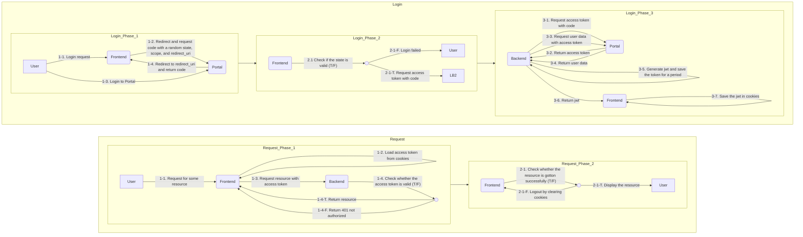

# Specification

## Requirements

### Homepage

1. Top Navigation Bar

   > Tablet and computer only
   - Buttons:
      - Admin Panel
        > only available to logged-in users
      - Homepage
      - NCU Website <https://ncu.edu.tw>
      - Language (Chinese and English)
      - Instagram <https://www.instagram.com/ncu7270>
      - Facebook <https://www.facebook.com/profile.php?id=100057326145371>

1. Main Navigation Bar

   - Logo that links to the homepage
      > Navigate to the [file](./frontend/assets/logo.png)
   - Buttons:
      - About Us (關於我們), linking to Work Team (工作團隊) in the side menu
      - Campus AED (校園 AED), linking to Campus AED (校園 AED) in the side menu
      - Regulations (相關法規), linking to Regulations (相關法規) in the side menu
      - Downloads (下載專區), linking to Downloads (下載專區) in the side menu
   - On mobile devices, only a logo and a menu button are displayed.

1. Carousel

   - Link to a post
   - Aspect ratio 16:9
   - Buttons to switch to the next and previous slides

1. News

   > Navigate to [Post](#post)
   - Every row contains the following information:
     - Post column (訊息類別)
     - Title (主題)
     - Released date (發佈日期)
   - Link to its page
   - Grouped buttons to switch between post columns
   - Navigation control panel to display and control pagination
   - A link to the post page to display all posts, including the following functionalities:
     - All functionalities above
     - Specify page number
     - Search post

1. Restaurant Reports (餐廳檢查報告)

   > Navigate to [Restaurant](#restaurant)
   - Each row contains the following information:
     - Restaurant name (商家名稱)
     - Inspect item (檢驗項目)
     - Inspect sample (抽檢樣品)
     - Result (抽檢結果)
     - Inspect date (檢驗日期)
   - Link to its page
   - Navigation control panel to display and control pagination
   - A link to the restaurant report page to display all reports, including the following functionalities:
     - All functionalities above
     - Specify page number
     - Search post

1. Side Menu / Drawer

   - Side menu is displayed on the tablets and computers, while the drawer is displayed on the mobiles
   - The following is the groups and items in the menu:
     > Navigate to [Static Page](#static-page)
     >
     > The column with bold font and `*` are not belongs to static page because they will have another functionality more than normal static page
     - About Us (關於我們)
       - Work Team (工作團隊)
       - Service Hours (服務時間)
       - Traffic Map (交通地圖)
     - Physical Check-up (健康檢查)
       - Freshmen Check-up (新生健康檢查)
       - New Staff Check-up (新進人員體格檢查)
       - Regular Check-up (定期健康檢查)
     - Emergency (緊急醫療)
       - Emergency Hotline (緊急通報專線)
       - Injury Treatment (校園傷病處理)
       - Campus AED (校園 AED)
     - Health Services (健康服務)
       - Student Group Insurance (學生團體保險)
       - Medical Equipment Loan (醫療器材借用)
       - Health Management Facilities (健康管理設施)
     - Healthy Workplace (健康職場)
       - Occupational Physician Service (職業醫師臨校服務)
       - Workplace Health Service Plan (職場健康服務計畫)
     - Education (教育訓練)
       - Freshmen CPR (大一 CPR)
       - Tabacco Prevention (校園菸害防制)
       - AIDS Prevention (校園愛滋防治)
       - [**Disease Prevention (校園傳染病防治) \***](#disease-prevention)
     - Others (其他)
       - Regulations (相關法規)
       - [**Downloads (下載專區) \***](#downloads)
   - The buttons shown on ***Top Navigation Bar*** also have to be shown on drawer

### Static Page

- Frontstage
  - Views count
  - Content
- Backstage
  - Two scopes to edit Chinese and English content
  - Form fields:
    - Page Topic
    - Content
  - Buttons:
    - Upload Attachment
    - Save and Upload
  - There have to be a list to show attachments and to change their order.

### Disease Prevention

- Frontstage
  - List
    - Keyword search
    - Column selection
    - A table with information:
      - Column
      - Title
      - Importance
      - Updated date
  - Content
    - Views count
    - Updated date
    - All the form fields below
- Backstage
  - Two scopes to edit Chinese and English content
  - Form fields:
    - Title
    - Column
      - Influenza (流行性感冒)
      - Dengue (登革熱)
      - Tuberculosis (肺結核)
      - Chicken Pox (水痘)
    - Content
    - Visibility
    - Importance
  - Buttons
    - Delete
    - Cancel
    - Upload Attachment
    - Save and Upload
  - There have to be a list to show attachments and to change their order.

### Downloads

- Frontstage
  > Example: <https://www.oga.ncu.edu.tw/1d0c71b2/news/b68d0dbf>
  - Keyword search
  - Column selection
  - A table with information:
    - Updated date
    - Column
    - Attachment filename (click and download)
- Backstage
  - Two scopes to edit Chinese and English content
  - Form fields:
    - Attachment (With upload button)
    - Column
      - Freshmen Check-up (新生健康檢查)
      - Student Group Insurance (學生團體保險)
      - Staff Check-up (教職員工健康檢查)
      - Medical Equipment Loan (醫療物品借用)
      - Others (其他)
  - Buttons:
    - Cancel
    - Delete
    - Save

### Restaurant

- Frontstage
  - Views count
  - Inspection date
  - All the form fields below
- Backstage
  - Two scopes to edit Chinese and English content
  - Form fields:
    - Restaurant name (title)
      > Less or equal than 25
    - Inspection date
    - Inspect item
      - Water (飲用水)
      - Food (熟食)
      - Drink (飲料)
      - Ice (冰塊)
      - Others (其他)
    - Inspect sample
      > Less or equal than 8
    - Inspect result
    - Visibility
    - Importance
    - Content
  - Buttons:
    - Delete
    - Cancel
    - Upload Attachments
    - Save and Upload
  - There have to be a list to show attachments and to change their order.

### Post

- Frontstage
  - Views count
  - Updated date
  - All the form fields below
- Backstage
  - Two scopes to edit Chinese and English content
  - Download the report by date range
  - Form fields:
    - Title
      > Less or equal than 25
    - Column
      - Latest (最新消息)
      - Activity (活動快訊)
      - Health (健康焦點)
      - Nutrution (營養報報)
    - Visibility
    - Importance
    - Content
  - Buttons:
    - Delete
    - Cancel
    - Upload Attachments
    - Save and Upload
  - There have to be a list to show attachments and to change their order.

### Dengue Form

> English is not required for this page

- Form
  - Users can only select the building which is assigned to them
  - Questions:
    1. 您的住家屋外或周圍環境是否有下列容器？
       1. 空瓶、空罐
          > 這些是否已清除（若未清除請馬上動手清除）
       1. 陶甕、水缸
          > 這些是否已清除（若未清除請馬上動手清除）
       1. 杯子、碟子、盤子、碗
          > 這些是否已清除（若未清除請馬上動手清除）
       1. 鍋、壺
          > 這些是否已清除（若未清除請馬上動手清除）
       1. 保麗龍製品或塑膠製品、免洗餐具
          > 這些是否已清除（若未清除請馬上動手清除）
       1. 桶子（木桶、鐵桶、塑膠桶等）
          > 這些是否已清除（若未清除請馬上動手清除）
       1. 椰子殼
          > 這些是否已清除（若未清除請馬上動手清除）
       1. 廢輪胎、廢安全帽
          > 請移除或以土填滿並種小花等植物
       1. 屋簷旁排水管、帆布、遮雨棚
          > 裡面是否阻塞積水（若有請立即疏通）
       1. 廢棄冰箱、洗衣機、馬桶或水族箱
          > 是否有開口？內部是否有積水？是否倒置或密封保持乾燥？
       1. 不使用或未加蓋的水塔（蓄水塔）
          > 是否有開口？內部是否有積水？是否倒置或密封保持乾燥？
       1. 未使用中的冷氣、冷卻水塔、冷飲櫃
          > 是否有開口？內部是否有積水？是否倒置或密封保持乾燥？
       1. 大型儲水桶有無加蓋或蓋細紗網
          > 儲水容器請記得加蓋或蓋細紗網，不用時倒置。
       1. 寵物水盤、雞、鴨、家禽、鳥籠或鴿舍內飲水槽、馬槽水
          > 是否一週換水一次並刷洗乾淨？
       1. 積水地下室
          > 水是否已清除？
       1. 地下室內的集水井
          > 是否有孑孓孳生？
       1. 自來水表或瓦斯表
          > 內部是否漏水或積水？是否倒置保持乾燥？
       1. 門外信箱
          > 內部是否漏水或積水？是否倒置保持乾燥？
       1. 燒金紙的桶子
          > 內部是否漏水或積水？是否倒置保持乾燥？
       1. 雨鞋、雨衣
          > 內部是否漏水或積水？是否倒置保持乾燥？
       1. 天然積水容器（竹籬笆竹節頂端、竹筒、樹幹上的樹洞、大型樹葉）
          > 是否以土填滿並種小花等植物？
       1. 旗座水泥樁上及其他可積水之水管
          > 把水倒掉，若暫不使用則封住開口
       1. 假山造型水池（凹槽處）、冷氣機滴水
          > 是否有孑孓孳生？
       1. 水溝積水有孑孓孳生
          > 裡面是否阻塞？（若有請立即疏通）
       1. 其他（任何容器或雜物） (This is an open question)
    1. 您的住宅內是否有下列容器？
       1. 花盤、花瓶、插水生植物容器（如：萬年青、黃金葛等）
          > 是否一週換水一次，並洗刷乾淨？
       1. 澆花灑水桶、花盆盆栽底盤
          > 是否洗刷乾淨？不用時是否倒置？
       1. 貯水容器（水缸、水泥槽、水桶、陶甕等或盛裝寵物飲水容器）
          > 一週換水一次，並洗刷乾淨？貯水容器是否有加蓋密封？
       1. 冰箱底盤、烘碗機底盤、開飲機底盤、泡茶用水盤
          > 是否一週換水一次，並洗刷乾淨？
       1. 其他 (This is an open question)
- Backstage
  - Create buildings and assign a building to a user with portal ID
  - Download the report by month range

### Student Group Insurance

> This is a backstage-only functionality
>
> English is not required for this page

- List
  - Keyword search
  - A table with information:
    - ID
    - Application date
    - Accident date
    - Name
    - Student ID
    - Claim content
    - Payment category
    - Place
    - Claim amount
    - Claim date
    - Insurance company received date
- Edit page
  - Form fields:
    - Basic Information (基本資訊)
      - ID (編號)
        > Auto generated
      - Applied date (申請日期)
        > Auto filled
      - Accident date (事故日期)
      - Name (姓名)
      - Student ID (學號)
      - National ID (身分證字號)
      - Address (地址)
      - Phone (電話)
      - Email
    - Insurance Information (保險資訊)
      - Claim Content (理賠內容)
        - Accident (意外)
        - Disease (疾病)
      - Payment Category (給付類別)
        - Medical (醫療)
        - Disability (失能)
        - First Diagnosis of Cancer (初次罹癌)
        - Death (身故)
      - Place (地點)
        - On-campus (校內)
        - Off-campus (校外)
      - Accident Cause (事故原因)
      - Receipt (收據)
        > Hospital name and quantity
      - Certificate (診斷書)
        > Hospital name and quantity
      - Bankbook (存摺)
        > Selections from 0 to 3
      - X-ray (X 光)
        > Selections from 0 to 3
      - Requested Amount (申請金額)
        > NTD
      - Remark (備註)
      - Claim Amount (理賠金額)
        > NTD
      - Claim Date (理賠日期)
      - Insurance Company Received Date (保險公司收件日期)

### Permission Management

- Using portal ID to add user and grant a role
- Role:
  - Normal
  - StudentB
  - StudentA
  - Admin

### Login

- Using NCU portal OAuth
  > Document: <https://portal.ncu.edu.tw/about/howto>
  >
  > App Setting: <https://portal.ncu.edu.tw/my/applications>
  >
  > OAuth: <https://www.rfc-editor.org/rfc/rfc6749>

## Frontend Routes

> Represented as Next.js app route directory structure

- `/`: Home page
  - `[locale]`: Internationalization
    - `post`: Show all posts with keyword search and category filter
      - `[id]`: Show the specified post
    - `restaurant`: Show all restaurant reports with keyword search and category filter
      - `[id]`: Show the specified restaurant report
    - `page` / `[id]`: Show the specified page
    - `disease`: Show all disease posts with keyword search and category filter
      - `[id]`: Show the specified disease post
    - `download`: Show all download links with keyword search and category filter
    - `privacy`: Show the privacy announcement
    - `dengue`: Show all dengue filled history
      - `new`: Create a new dengue form
    - `admin`: Show all accessible admin pages
      - `carousel`: Show all uploaded carousel, to create and to manage them
      - `post`: Show all created post, to create and manage them
        - `new`: Create a new carousel
        - `edit` / `[id]`: Edit an existing carousel
      - `restaurant`: Show all created restaurant reports
        - `new`: Create a new restaurant report
        - `edit` / `[id]`: Edit an existing restaurant report
      - `page` / `edit` / `[id]`: Edit the specified static page
      - `dengue`: Show all building managers and manage them, and download the report
      - `insurance`: Show all insurance information, create and manage them
        - `edit` / `[id]`: Create a new insurance information
      - `permission`: Show all users and manage them
    - `login`: A button to redirect to the portal
    - `logout`: Clear access token cookies
    - `redirect`: The landing page to wait for auth token
  - `callback`: Receive auth token from the backend server

## APIs

### Execptions

> Datetime formate iso-8601

```json5
500: {
    "message": "Internal Sever Error",
    "data": {}
}
```

```json5
422: {
    "message": "'...' not found in json",
    "data": {}
}
```

```json5
404: {
    "message": "... not found",
    "data": {}
}
```

### Attachment

- **GET** `/api/attachmet/<id>`
  > Get an attachment blob
  
  - Content-Type: (file)
  - Response: 200 (file)

- **GET** `/api/attachmet/<id>/info`
  > Get an attachment info

  - Content-Type: application/json
  - Response:

    ```json5
    200: {
        "message": "get attachmet info successful",
        "data": {
            "id": 123,
            "filename": "string",
            "updated_time": "datetime",
            "created_time": "datetime"
        }
    }
    ```

- **POST** `/api/attachment`
  > Upload an attachment
  
  - Accept: multipart/form-data
  - Fields:
    - blob: (file)
  - Content-Type: application/json
  - Response:

    ```json5
    201: {
        "message": "create attachment successful",
        "data": {
            "id": 123,
            "filename": "string",
            "updated_time": "datetime",
            "created_time": "datetime"
        }
    }
    ```

- **DELETE** `/api/attachmet/<id>`
  > Delete an attachment

  - Response:

    ```json5
    204: null
    ```

### Image

- **GET** `/api/image/<id>`
  > Get an image blob

  - Query:
    - visibility: false (default false)
  - Content-Type: (image)
  - Response: 200 (image)

- **POST** `/api/image`
  > Upload an image
  
  - Accept: multipart/form-data
  - Fields:
    - blob: (image)
  - Content-Type: application/json
  - Response:

    ```json5
    201: {
        "message": "create attachment successful",
        "data": {
            "id": 123,
            "filename": "string",
            "updated_time": "datetime",
            "created_time": "datetime"
        }
    }
    ```

- **DELETE** `/api/image/<id>`
  > Delete an image

  - Response: 204

    ```json5
    204: null
    ```

### Carousel

- **GET** `/api/carousel`
  > Get all carousels
  
  - Content-Type: application/json
  - Response:

    ```json5
    200: {
        "message": "get all carousels successful",
        "data": [
            {
                "id": 123,
                "title": "string",
                "content": "string",
                "visibility": true,
                "updated_time": "datetime",
                "created_time": "datetime"
            },
        ]
    }
    ```

- **GET** `/api/carousel/<id>/info`
  > Get the carousel
  
  - Content-Type: application/json
  - Response:

    ```json5
    200: {
        "message": "get all carousels successful",
        "data": {
            "id": 123,
            "title": "string",
            "content": "string",
            "visibility": true,
            "updated_time": "datetime",
            "created_time": "datetime"
        }
    }
    ```

- **GET** `/api/carousel/<id>`
  > Get the carousel
  
  - Content-Type: (image)
  - Response: 200 (image)

- **POST** `/api/carousel`
  > Create a carousel

  - Accept: multipart/from-data
  - Fields:
    - blob: (file)
    - title: "string"
    - content: "string"
    - visibility: false
  - Response:

    ```json5
    201: null
    ```

- **PATCH** `/api/carousel/<id>`
  > Modify the carousel info

  - Accept: multipart/from-data
  - Fields:
    - blob: (file)
    - title: "string"
    - content: "string"
    - visibility: false
  - Response:

    ```json5
    204: null
    ```

- **DELETE** `/api/carousel/<id>`
  > Delete a carousel

  - Response:

    ```json5
    204: null
    ```

### Post

> Static posts are pre-defined from 0 ~ 99, the id of normal posts should start from 100

- **GET** `/api/post`
  > Get all posts
  
  - Query:
    - column: "string" (seperated by '+')
    - visibility: false (default: false)
    - limit: 123 (default: 10)
    - page: 123 (default: 1)
    - search: "string"
  - Content-Type: application/json
  - Response:

    ```json5
    200: {
        "message": "get post successful",
        "data": {
            "page": 123,
            "total_pages": 123,
            "posts": [
                {
                    "id": 123,
                    "title": "string",
                    "content": "string",
                    "column": "string",
                    "attachments": [123],
                    "view": 123,
                    "importance": true,
                    "visibility": true,
                    "updated_time": "datetime",
                    "created_time": "datetime"
                }
            ]
        }

    }
    ```

- **GET** `/api/post/<id>`
  > Get a post

  - Content-Type: application/json
  - Response:

    ```json5
    200: {
        "message": "get post successful",
        "data": {
                "id": 123
                "title": "string",
                "content": "string",
                "column": "string",
                "attachments": [123],
                "view": 123,
                "importance": true,
                "visibility": true,
                "updated_time": "datetime",
                "created_time": "datetime"
        }
    }
    ```

- **POST** `/api/post`
  > Create a post

  - Accept: application/json
  - Request:

    ```json5
    {
        "title": "string",
        "content": "string",
        "column": "string",
        "attachments": [123],
        "importance": true,
        "visibility": true
    }
    ```

  - Response:

    ```json5
    201: null
    ```

- **DELETE** `/api/post/<id>`
  > Delete the post

  - Response:

    ```json5
    204: null
    ```

### Insurance

### Auth

- **POST** `/api/auth/login`
  > Login with portal oauth code

  - Accept: application/json
  - Request:

    ```json5
    {
        "code": "string"
    }
    ```

  - Content-Type: application/json
  - Response:

    ```json5
    200: {
        "message": "",
        "data": {
            "token": "string"
        }
    }
    ```
  
- **POST** `/api/auth/logout`
  > Logout
  
  - Response:

    ```json5
    204: null
    ```

### Dengue

#### Form

- **GET** `/api/dengue/form`
  > Get all forms
  
  - Query:
    - user_id: "string"
  - Content-Type: application/json
  - Response:

    ```json5
    200: {
        "message": "",
        "data": {
            "id": 123,
            "building_id": 123,
            "form": {
                "1": {
                    "title": "string",
                    "value": true | "string"
                },
                "1_sub": {
                    "title": "string",
                    "value": true | "string"
                }
            },
            "inspection_time": "datetime",
            "created_time": "datetime",
            "updated_time": "datetime"
        }
    }
    ```

- **POST** `/api/dengue/form`
  > Create a form

  - Accept: application/json
  - Request:

    ```json5
    {
        "building_id": 123,
        "form": {
            "1": {
                "title": "string",
                "value": true | "string"
            },
            "1_sub": {
                "title": "string",
                "value": true | "string"
            }
        },
        "inspection_time": "datetime",
    }
    ```

  - Response:

    ```json5
    201: null
    ```

- **GET** `/api/dengue/form-report`
  > Download report for all forms

  - Query:
    - from: "datetime"
    - to: "datetime"
  - Content-Type: application/vnd.openxmlformats-officedocument.spreadsheetml.sheet
  - Response: 200 (.xlsx)

- **GET** `/api/dengue/form-report/<id>`
  > Download report for the form

  - Content-Type: application/vnd.openxmlformats-officedocument.spreadsheetml.sheet
  - Response: 200 (.xlsx)

- **GET** `/api/dengue/form-status`
  > Get filled status
  >
  > It returns months for which the form has not yet been filled in for last year
  
  - Content-Type: application/json
  - Response:

    ```json5
    200: {
        "message": "",
        "data": [
            {
                "id": 123,
                "status": ["datatime"]
            }
        ]
    }
    ```

- **DELETE** `/api/dengue/form/<id>`
  > Delete the form

  - Response:

    ```json5
    204: null
    ```

#### Building

- **Get** `/api/dengue/building`
  > Get all buildings
  >
  > It's should return results depending on the current user

  - Query:
    - search: "string"
  - Content-Type: application/json
  - Response:

    ```json5
    200: {
        "message": "",
        "data": [
            {
                "id": 123,
                "name": "string",
                "user_id": "string" | null,
                "created_time": "datetime",
                "updated_time": "datetime"
            }
        ]
    }
    ```

- **POST** `/api/dengue/building`
  > Create a building
  
  - Accept: application/json
  - Request:

    ```json5
    {
        "name": "string",
    }
    ```

  - Response:

    ```json5
    201: null
    ```

- **GET** `/api/dengue/building/<id>`
  > Get the building
  
  - Content-Type: application/json
  - Reponse:

    ```json5
    200: {
        "message": "",
        "data": {
            "id": 123,
            "name": "string",
            "user_id": "string" | null,
            "created_time": "datetime",
            "updated_time": "datetime"
        }
    }
    ```

- **PATCH** `/api/dengue/building/<id>`
  > Modify the building manager
  
  - Accept: application/json
  - Request:

    ```json5
    {
        "name": "string",
        "user_id": "string" | null
    }
    ```

- **DELETE** `/api/dengue/building/<id>`
  > Delete the building

  - Response:

    ```json5
    204: null
    ```

### Restaurant

- **GET** `/api/restaurant`
  > Get all restaurant
  
  - Query:
    - category: "string"
    - visibility: false (default: false)
    - limit: 123 (default: 10)
    - page: 123 (default: 1)
    - search: "string"
  - Content-Type: application/json
  - Response:

    ```json5
    200: {
        "message": "",
        "data": {
            "page": 123,
            "total_pages": 123,
            "restaurants": [
                {
                    "id": 123,
                    "title": "string",
                    "category": "string",
                    "item": "string",
                    "attachments": [123],
                    "view": 123,
                    "valid": true,
                    "visibility": true,
                    "updated_time": "datetime",
                    "created_time": "datetime"
                }
            ]
        }
    }
    ```

- **POST** `/api/restaurant`
  > Create a restaurant
  
  - Accept: application/json
  - Request:

    ```json5
    {
        "title": "string",
        "category": "string",
        "item": "string",
        "attachments": [123],
        "valid": true,
        "visibility": true,
    }
    ```

  - Response:

    ```json5
    201: null
    ```

- **GET** `/api/restaurant/report`
  > Download all restaurants report

  - Query:
    - from: "datetime"
    - to: "datetime"
  - Content-Type: application/vnd.openxmlformats-officedocument.spreadsheetml.sheet
  - Response: 200 (.xlsx)

- **GET** `/api/restaurant/<id>`
  > Get the restaurant

  - Content-Type: application/json
  - Response:

    ```json5
    200: {
        "message": "",
        "data": {
            "id": 123,
            "title": "string",
            "category": "string",
            "item": "string",
            "attachments": [123],
            "view": 123,
            "valid": true,
            "visibility": true,
            "updated_time": "datetime",
            "created_time": "datetime"
        }
    }
    ```

- **PATCH** `/api/restaurant/<id>`
  > Modify the restaurant

  - Accept: application/json
  - Request:
  
    ```json5
    {
        "title": "string",
        "category": "string",
        "item": "string",
        "attachments": [123],
        "valid": true,
        "visibility": true,
    }
    ```

  - Response:

    ```json5
    204: null
    ```

- **DELETE** `/api/restaurant/<id>`
  > Delete the restaurant

  - Response:

    ```json5
    204: null
    ```

### Download

- **GET** `/api/download`
  > Get all download links

  - Query:
    - search: "string"
    - column: "string" (seperated by '+')
    - visibility: false (defalt false)
  - Content-Type: application/json
  - Response:

    ```json5
    200: {
        "message": "string",
        "data": [
            {
                "id": 123,
                "title": "string",
                "column": "string",
                "visibility": true,
                "updated_time": "datetime",
                "created_time": "datetime"
            }
        ]
    }
    ```

- **POST** `/api/download`
  > Create a download link

  - Accept: multipart/from-data
  - Fields:
    - blob: (file)
    - title: "string"
    - column: "string"
    - visibility: false
  - Response:

    ```json5
    201: null
    ```

- **GET** `/api/download/<id>`
  > Download the file

  - Content-Type: (file)
  - Response: 200 (file)

- **GET** `/api/download/<id>/info`
  > Get the download info

  - Content-Type: application/json
  - Response:

    ```json5
    200: {
        "message": "",
        "data": {
            "id": 123,
            "title": "string",
            "column": "string",
            "visibility": true,
            "updated_time": "datetime",
            "created_time": "datetime"
        }
    }
    ```

- **PATCH** `/api/download/<id>`
  > Modify the download

  - Accept: application/json
  - Request:

    ```json5
    {
        "title": "string",
        "column": "string",
        "visibility": true
    }
    ```

  - Response:

    ```json5
    204: null
    ```

### User

- **GET** `/api/user/me`
  > Get the current user info
  
  - Content-Type: application/json
  - Response:

    ```json5
    200: {
        "message": "",
        "data": {
            "id": "string",
            "chinese_name": "string",
            "role": 123,
            "created_time": "datetime",
            "updated_time": "datetime"
        }
    }
    ```

- **GET** `/api/user`
  > Get all users
  
  - Query:
    - role: number
    - search: "string"
  - Content-Type: application/json
  - Response:

    ```json5
    200: {
        "message": "",
        "data": [
            {
                "id": "string",
                "chinese_name": "string",
                "role": 123,
                "created_time": "datetime",
                "updated_time": "datetime"
            }
        ]
    }
    ```

- **GET** `/api/user/<id>`
  > Get the user

  - Content-Type: application/json
  - Response:

    ```json5
    200: {
        "message": "",
        "data": {
            "id": "string",
            "chinese_name": "string",
            "role": 123,
            "created_time": "datetime",
            "updated_time": "datetime"
        }
    }
    ```

- **PATCH** `/api/user/<id>`
  > Modify the user's role
  
  - Accept: application/json
  - Request:

    ```json5
    {
        "role": 123
    }
    ```

  - Response:

    ```json5
    204: null
    ```

### Insurance

### Auth

- **POST** `/api/auth/login`
  > Login with portal oauth code

  - Accept: application/json
  - Request:

    ```json5
    {
        "code": "string"
    }
    ```

  - Content-Type: application/json
  - Response:

    ```json5
    200: {
        "message": "",
        "data": {
            "token": "string"
        }
    }
    ```
  
- **POST** `/api/auth/logout`
  > Logout
  
  - Response:

    ```json5
    204: null
    ```

### Dengue

#### Form

- **GET** `/api/dengue/form`
  > Get all forms
  
  - Query:
    - user_id: "string"
  - Content-Type: application/json
  - Response:

    ```json5
    200: {
        "message": "",
        "data": {
            "id": 123,
            "building_id": 123,
            "form": {
                "1": {
                    "title": "string",
                    "value": true | "string"
                },
                "1_sub": {
                    "title": "string",
                    "value": true | "string"
                }
            },
            "filled_time": "datetime",
            "created_time": "datetime",
            "updated_time": "datetime"
        }
    }
    ```

- **POST** `/api/dengue/form`
  > Create a form

- **GET** `/api/dengue/form-report`
  > Download report for all forms

- **GET** `/api/dengue/form-report/<id>`
  > Download report for the form

- **GET** `/api/dengue/form-status`
  > Get status of all forms

- **DELETE** `/api/dengue/form/<id>`
  > Delete the form

#### Building

- **Get** `/api/dengue/building`
  > Get all buildings

  - Query:
    - search: "string"
    - user_id: "string"
  - Content-Type: application/json
  - Response:

    ```json5
    200: {
        "message": "",
        "data": [
            {
                "id": 123,
                "name": "string",
                "user_id": "string" | null,
                "created_time": "datetime",
                "updated_time": "datetime"
            }
        ]
    }
    ```

- **POST** `/api/dengue/building`
  > Create a building
  
  - Accept: application/json
  - Request:

    ```json5
    {
        "name": "string",
    }
    ```

  - Response:

    ```json5
    201: null
    ```

- **GET** `/api/dengue/building/<id>`
  > Get the building
  
  - Content-Type: application/json
  - Reponse:

    ```json5
    200: {
        "message": "",
        "data": {
            "id": 123,
            "name": "string",
            "user_id": "string" | null,
            "created_time": "datetime",
            "updated_time": "datetime"
        }
    }
    ```

- **PATCH** `/api/dengue/building/<id>`
  > Modify the building manager
  
  - Accept: application/json
  - Request:

    ```json5
    {
        "name": "string",
        "user_id": "string" | null
    }
    ```

- **DELETE** `/api/dengue/building/<id>`
  > Delete the building

  - Response:

    ```json5
    204: null
    ```

### Restaurant

### Download

### User

- **GET** `/api/me`
  > Get the current user info
  
  - Content-Type: application/json
  - Response:

    ```json5
    200: {
        "message": "",
        "data": {
            "id": "string",
            "chinese_name": "string",
            "role": 123,
            "created_time": "datetime",
            "updated_time": "datetime"
        }
    }
    ```

- **GET** `/api/user`
  > Get all users
  
  - Query:
    - role: number
    - search: "string"
  - Content-Type: application/json
  - Response:

    ```json5
    200: {
        "message": "",
        "data": [
            {
                "id": "string",
                "chinese_name": "string",
                "role": 123,
                "created_time": "datetime",
                "updated_time": "datetime"
            }
        ]
    }
    ```

- **GET** `/api/user/<id>`
  > Get the user

  - Content-Type: application/json
  - Response:

    ```json5
    200: {
        "message": "",
        "data": {
            "id": "string",
            "chinese_name": "string",
            "role": 123,
            "created_time": "datetime",
            "updated_time": "datetime"
        }
    }
    ```

- **PATCH** `/api/user/<id>`
  > Modify the user's role
  
  - Accept: application/json
  - Request:

    ```json5
    {
        "role": 123
    }
    ```

  - Response:

    ```json5
    204: null
    ```

## Authentication


